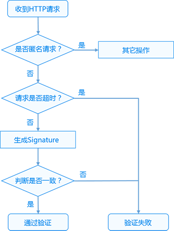

## Man-auth网关(apisix)鉴权插件

[](https://travis-ci.org/apache/incubator-apisix)
[](https://github.com/apache/incubator-apisix/blob/master/LICENSE)

Man-auth基于APISIX网关服务开发的一款鉴权插件,插件原理参考腾讯云OPEN API V3、百度云OPEN API V2开发。当前互联网最新主推的一种安全通用API ak/sk的鉴权方式。



## 优势?

- 更大程度保护Secret Key
- 对于请求者的身份进行验证
- 对被传输内容进行保护，防止中间非法篡改
- 防止重放攻击
- ak/sk读写etcd,更接近原生云
- 生成请求唯一ID,方便追踪

## hamc_sha256加密

Man-auth采用的是双hmac-sha256加密，SHA-1是160位的哈希值，而SHA-256是组合值，有不同的位数，其中最受欢迎的是256位。从2011到2015，一直以SHA-1位主导算法。但随着互联网技术的提升，SHA-1的缺点越来越突显，安全性下降。从去年起，SHA-256成为了新的标准，所以现在签发的SSL证书，必须使用该算法签名。
```shell
SHA1算法运行1000次的平均时间为：308ms
SHA256算法运行1000次的平均时间为：473ms
```

## 签名说明
API的安全认证一律采用Access Key与请求签名机制。 Access Key由Access Key ID和Secret Access Key组成，均为字符串。 对于每个HTTP请求，使用下面所描述的算法生成一个认证字符串。提交认证字符串放在Authorization头域里。服务端根据生成算法验证认证字符串的正确性。 认证字符串的格式为{accessKeyId}/{timestamp}/{project}/{signedHeaders}/{signature}。

API 支持 GET 和 POST 请求，对于GET方法，只支持 Content-Type: application/x-www-form-urlencoded 协议格式。对于POST方法，目前支持 Content-Type: application/json

* ``accessKeyId``	API密钥ID，secret_id与secret_key一一对应secret_key用来生成请求签名 signature
* ``timestamp``	时间戳，发起API请求的时间
* ``project``	区域参数，用来标识希望操作哪个区域的实例
* ``signedHeaders``	签名算法中涉及到的HTTP头域列表。HTTP头域名字一律要求小写且头域名字之间用分号（;）分隔，如Host。列表按照字典序排列。当signedHeaders为空时表示取默认值Host
* ``signature``	签名，是认证字符串的重要组成部分，其计算过程较复杂，会在文中详细介绍签名的生成过程
### 签名
签名的计算公式为signature = HMAC-SHA256-HEX(SigningKey,CanonicalRequest)，从公式可以看出，想要获得签名需要得到SigningKey和CanonicalRequest两个参数，接下来讲解如何获取这两个参数。

####生成CanonicalRequest
CanonicalRequest的计算公式为： CanonicalRequest = HTTP Method + "/" + CanonicalURI + "/" + CanonicalHeaders

#####HTTP Method
指HTTP协议中定义的GET、POST请求，必须使用全大写的形式。

#####CanonicalURI
CanonicalURI是对URL中的绝对路径进行编码后的结果，即CanonicalURI = UriEncodeExceptSlash(Path)。要求绝对路径Path必须以“/”开头，不以“/”开头的需要补充上，空路径为“/”。

若URL为http://web.xiaoman.cn/cvm/createInstance?test=abc，则其URL Path为%2fcvm%2fcreateInstance%3f%3ftest%3dabc，需UriEncode。

#####CanonicalHeaders
CanonicalHeaders是对HTTP请求中的Header部分进行选择性编码的结果。

选择编码的Header。 您可以自行决定哪些Header需要编码。API的唯一要求是Host域必须被编码。大多数情况下，我们推荐您对以下Header进行编码：

#####Host
Content-Length
Content-Type

将Header的名字变成全小写，注意仅改名字。
经过上一步之后值为空字符串的Header忽略，其余的转换为 UriEncode(name) + ":" + UriEncode(value) 的形式。
把上面转换后的所有字符串按照字典序进行排序。
将排序后的字符串按顺序用\n符号连接起来得到最终的CanonicalHeaders。

编码示例
如下是发送请求的Header:

```shell
Host: bj.xiaoman.com
Date: Mon, 27 Apr 2015 16:23:49 +0800
Content-Type: text/plain
Content-Length: 8
Content-Md5: NFzcPqhviddjRNnSOGo4rw==
x-bce-date: 2015-04-27T08:23:49
```
选择需要编码的Header，然后把所有名字都改为小写。
```shell
host: bj.xiaoman.com
date: Mon, 27 Apr 2015 16:23:49 +0800
content-type: text/plain
content-length: 8
 将Header的值去掉开头和结尾的空白字符。
host:bj.xiaoman.com
date:Mon, 27 Apr 2015 16:23:49 +0800
content-type:text/plain
content-length:8
```
对每个Header进行UriEncode转换。
```shell
host:bj.xiaoman.com
date:Mon%2C%2027%20Apr%202015%2016%3A23%3A49%20%2B0800
content-type:text%2Fplain
content-length:8
将步骤3中转换后的所有字符串按照字典序进行排序。
content-length:8
content-type:text%2Fplain
date:Mon%2C%2027%20Apr%202015%2016%3A23%3A49%20%2B0800
host:bj.xiaoman.com
```
将排序后的字符串按顺序用/符号连接起来得到最终结果。
```shell
content-length:8/content-type:text%2Fplain/date:Mon%2C%2027%20Apr%202015%2016%3A23%3A49%20%2B0800/host:bj.xiaoman.com
```
同时获得认证字符串的signedHeaders内容应该是content-length;content-type;date;host，当header信息值为空时，则跳过该头。

生成SigningKey
SigningKey = HMAC-SHA256-HEX(sk, authStringPrefix)，其中：

sk为用户的Secret Access Key，可以通过在控制台中进行查询；
authStringPrefix代表认证字符串的前缀部分，即：{accessKeyId}/{timestamp}/{project}。
生成Signature及认证字符串
通过上面的计算得到的SigningKey和CanonicalRequest按照下面公式可以得到签名。 Signature = HMAC-SHA256-HEX(SigningKey, CanonicalRequest)

最后根据公式{accessKeyId}/{timestamp}/{project}/{signedHeaders}/{signature}获得认证字符串。

Header中包含认证字符串
用户可以在HTTP请求的Header中包含Authorization信息，表明这个消息已被授权，即：在HTTP Header中加入Authorization: <认证字符串>。
```shell
GET /cvm/createInstance?getList=all HTTP/1.1
Authorization: baRHxZ5X112F5gsy/1573630136/weixin//d74a04362e6a848f5b39b15421cb449427f419c95a480fd6b8cf9fc783e2999e
Host: bj.xiaoman.com
Date: Mon, 27 Apr 2019 16:23:49 +0800
Content-Type: text/plain
Content-Length: 8
```


## 传送门
- [apisix](https://github.com/apache/incubator-apisix)
- [openresty](http://openresty.org/en/)
- [openresty最佳实践(lua手册中文)](https://moonbingbing.gitbooks.io/openresty-best-practices/)
